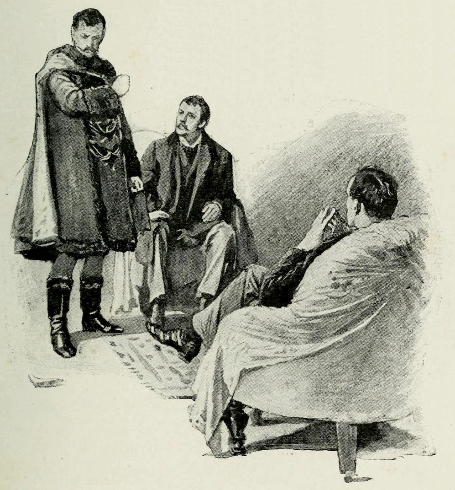
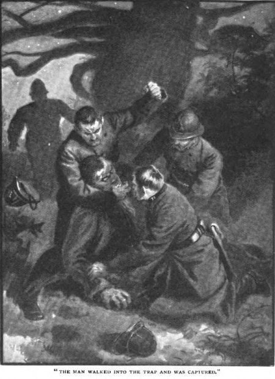

```{r setup, include=FALSE}
knitr::opts_chunk$set(echo = TRUE)
library(dplyr)
options(dplyr.print_max = 6, dplyr.print_min = 6)
options(width = 68)
```

### Packages

To run the following code, make sure you have loaded (and installed)
the following packages. We like to set **ggplot2** to use the minimal
theme, but this is of course entirely optional.

```{r, message=FALSE}
library(cleanNLP)
library(dplyr)
library(readr)
library(stringi)
library(ggplot2)
theme_set(theme_minimal())
```

# Tokenisation

### Splitting text into words

Consider a string in R containing the first paragraph
of text from the novel *L'Étranger* of Albert Camus
(we'll use `stri_wrap` just to fit the output on the
slide):

```{r, echo = FALSE}
letranger <- stri_c(
"Aujourd'hui, maman est morte. Ou peut-être hier, je ne sais pas.",
"J'ai reçu un télégramme de l'asile: «Mère décédée. Enterrement demain.",
"Sentiments distingués.» Cela ne veut rien dire. C'était peut-être",
"hier.", collapse = " ")
```
```{r, tidy.opts=list(width.cutoff=60)}
stri_wrap(letranger)
```

\pause In order to work with this text, a good first step is to
split it apart into its constituent words.

### Splitting with whitespace

Splitting on whitespace alone works reasonably well, though
there are some issues with punctuation marks:

```{r, tidy.opts=list(width.cutoff=60)}
stri_split(letranger, fixed = " ")
```

### Splitting with cleanNLP

There are a number of packages that support the more complex
logic needed to deal with many of these errors. Here we'll use
the **cleanNLP** package as it will be easy to adapt our
approach to work with more complex annotators in the next
section.

### Running annotations

We start by initialising the tokenizers back end within
the **cleanNLP** package. We'll indicate that we want a
French locale as this input text is in French.

```{r, message = FALSE}
library(cleanNLP)
init_tokenizers(locale = "fr")
```

\pause Then, we run the annotators over the text. We set
the option `as_strings` because we are passing the text
into the function as a raw string:

```{r, message = FALSE}
letranger_anno <- run_annotators(letranger, as_strings = TRUE)
letranger_anno
```

### An annotation object

The result seems to be wrapped up in a fairly complex object;
however, it is nothing more than a list of data frames.
To collapse all of these lists into a one table summary of
the tokenisation process, we will call the function `get_combine`
on the annotation object:

```{r}
letranger_tokens <- get_combine(letranger_anno)
```

### An annotation object

The result is a data frame with one row for each token.
Meta data about each token, such as the sentence number
and character offset, are included as columns.

```{r}
letranger_tokens
```

### cleanNLP tokenization results

Notice that the resulting tokens fix most of the problems
in the original white space based technique:

```{r}
letranger_tokens$word
```


### Corpus Metadata

A dataset where each record is its own text is known
as a *corpus*. In the remainder of this session, we
will be working with a corpus of the 56 short stories
featuring Sherlock Holmes.

We start by constructing a meta data table of these stories:

```{r}
paths <- dir("data/holmes_stories", full.names = TRUE)
sh_meta <- data_frame(id = seq_along(paths),
                   story = stri_sub(basename(paths), 4, -5))
sh_meta %>% print(n = 5)
```

### Annotating files on disk

We want to construct a similar data frame of tokens for
all of the short stories in our corpus. As a first step,
we will re-initalise the tokenizers backend using an
English locale:

```{r, message = FALSE}
library(cleanNLP)
init_tokenizers(locale = "en_GB")
```

Then, we call the annotation engine with
the paths to the files instead of the raw
text:

```{r, message = FALSE}
sh_anno <- run_annotators(paths)
```

And once again, collapse the object into a single
table.

```{r}
sh_tokens <- get_combine(sh_anno)
```

### Sherlock Holmes tokens

The resulting table, as before, has one row for each
token in the original dataset.

```{r}
sh_tokens
```

### Sherlock Holmes tokens, sentence 10

```{r}
sh_tokens %>% filter(id == 1) %>% filter(sid == 10) %>% print(n = 12)
```

# Tokens and style

### Using tokens

One can often learn a lot about a corpus by simply
finding the occurances of certain tokens or patterns
of tokens within it.

For example:

- length of sentences
- number of citations
- presence of known characters
- count of hashtags in a tweet
- ratio of quotes/dialogue to raw text

### Visualising Watson and Holmes

Where do Watson and Holmes occur within each text?

```{r, eval = FALSE}
sh_tokens %>%
  group_by(id) %>%
  mutate(percentage_loc = sid / max(sid)) %>%
  filter(word %in% c("Watson", "Holmes")) %>%
  ggplot(aes(percentage_loc, id)) +
    geom_point(aes(color = word), alpha = 0.5) +
    geom_hline(yintercept = 44)
```

### Visualising Watson and Holmes

```{r, echo = FALSE, message = FALSE}
library(viridis)
sh_tokens %>%
  group_by(id) %>%
  mutate(percentage_loc = sid / max(sid)) %>%
  filter(word %in% c("Watson", "Holmes")) %>%
  ggplot(aes(percentage_loc, id)) +
    geom_point(aes(color = word), alpha = 0.5) +
    scale_color_viridis(discrete=TRUE, end = 0.7, option = "C") +
    geom_hline(yintercept = 44)
```

### Average sentence length

By counting the number of periods, question marks,
and exclamation marks, we can approximate the average
length of each sentence in the text.

```{r, eval = FALSE}
sh_tokens %>%
  mutate(sentence_end = sh$word %in% c(".", "?", "!")) %>%
  group_by(id) %>%
  summarize(mean_sentence_len = n() / sum(sentence_end)) %>%
  ggplot(aes(id, mean_sentence_len)) +
    geom_line() +
    geom_point()
```

### Average sentence length

```{r, echo = FALSE}
sh_tokens %>%
  mutate(sentence_end = sh_tokens$word %in% c(".", "?", "!")) %>%
  group_by(id) %>%
  summarize(mean_sentence_len = n() / sum(sentence_end)) %>%
  ggplot(aes(id, mean_sentence_len)) +
    geom_line() +
    geom_point()
```

# Most frequent tokens

### Frequency tokens

In our first set of analyses, we used our prior knowledge
to determine which tokens would be interesting to identify
and tabulate.

Alternatively, we can let the corpus itself tell us which
terms would be the most interesting. Often just knowing
which terms are the most frequent, or occur in certain
patterns, is interesting itself.

### Naïve approach

To begin, we can see what the most common words are across
the corpus using the `count` function:

```{r, eval = FALSE}
sh_tokens %>%
  count(id, word, sort = TRUE)
```
```{r, echo = FALSE}
sh_tokens %>%
  count(id, word, sort = TRUE) %>%
  ungroup()
```

### Stop words

What is interesting about these top terms? Cynically, we might say
very little. The problem is that the most common terms are simply
punctuation marks.

If we look farther down the list, common function words such as
'the' and 'my' dominate the counts.

```{r, echo = FALSE}
temp <- sh_tokens %>%
  count(id, word, sort = TRUE) %>%
  ungroup()
arrange(temp, id)[5:10,]
```

A popular way of dealing with this problem is to define a
list of *stop words*, those tokens that are common enough
to be thematically uninteresting.

### Stop words

We have included a simple list of stop words in the dataset for
today, which you should read in with the following.

```{r}
stopwords <- readLines("data/stopwords_en.txt")
sample(stopwords, 25L)
```

Take a moment to look at some of the words. What parts of speech
dominate the list?

### Most common non-stopwords

We will make use of the `top_n` function to select
just the top 10 occurrences within each text. We
also add a call to `left_join` to explicitly add the
names of each story to the output:

```{r}
sh_toptokens <- sh_tokens %>%
  filter(!(tolower(word) %in% stopwords)) %>%
  count(id, word, sort = TRUE) %>%
  top_n(n = 10, n) %>%
  left_join(sh_meta, by = "id")
```
```{r, echo=FALSE}
sh_toptokens <- ungroup(sh_toptokens)
```

### 'A Scandal in Bohemia'



### Tokens from 'A Scandal in Bohemia'

```{r}
sh_toptokens %>% filter(id == 1) %>% print(n = Inf)
```

### 'The Musgrave Ritual'


### Tokens from 'The Musgrave Ritual'

```{r}
sh_toptokens %>% filter(id == 17) %>% print(n = Inf)
```

### 'His Last Bow'



### Tokens from 'His Last Bow'

```{r}
sh_toptokens %>% filter(id == 44) %>% print(n = Inf)
```

# Extracting and Locating Characters

### Why characters?

One particular category that floats to the top
of our lists of most frequent tokens are the main characters
for each story. Identifying the people mentioned in
a corpus of text has many applications, including:

- on social media it indicates trending issues
- in news articles, the people mentioned give a good
clue as to what topics are being discussed (politics,
food, culture, local events, ..)
- in fiction, as we have seen, the presence and absence
of characters is a major indicator of plot arcs

### Proper nouns

Some of the most frequenct non stop words in the texts refer
to the names of the characters. How might we extract these
directly?

```{r}
sh_propn <- sh_tokens %>%
  filter(!(tolower(word) %in% stopwords)) %>%
  filter((tolower(word) != word)) %>%
  count(id, word, sort = TRUE) %>%
  top_n(n = 10, n) %>%
  left_join(sh_meta, by = "id")
```
```{r, echo=FALSE}
sh_propn <- ungroup(sh_propn)
```

### Proper nouns from 'A Scandal in Bohemia'

```{r}
sh_propn %>% filter(id == 1) %>% print(n = Inf)
```

### Proper nouns from 'The Musgrave Ritual'

```{r}
sh_propn %>% filter(id == 17) %>% print(n = Inf)
```

### Proper nouns from 'His Last Bow'

```{r}
sh_propn %>% filter(id == 44) %>% print(n = Inf)
```

### One top character

Of course, two major characters are always going to be Sherlock
Holmes and John Watson. Let us remove them from the list, as well
as any names shorter than four characters (these are usually
honorific rather than names). We will then take the most
mentioned character from each text:

```{r}
holmes_watson <- c("Sherlock", "Holmes", "John", "Watson")
sh_topchar <- sh_tokens %>%
  filter(stri_length(word) > 4) %>%
  filter(!(word %in% holmes_watson)) %>%
  filter(!(tolower(word) %in% stopwords)) %>%
  filter((tolower(word) != word)) %>%
  count(id, word) %>%
  left_join(sh_meta, by = "id") %>%
  top_n(n = 1, n)
```
```{r, echo = FALSE}
sh_topchar <- ungroup(sh_topchar)
```

### One top character, cont.

```{r}
sh_topchar %>% filter(id %in% c(1, 12, 17, 45)) %>%
  print(n = Inf)
```

### Top name

Sometimes this works well, sometimes is picks up the right idea
but not enough to really know who the character is (i.e., "Colonel"
or "Majesty"), and sometimes it works very well. We will see in
the next session how to do a better job of this using more advanced
annotation engines.

### Visualising main characters

We will make use of the `semi_join` function to plot the character
locations:

```{r, eval = FALSE}
sh_tokens %>%
  group_by(id) %>%
  mutate(percentage_loc = sid / max(sid)) %>%
  semi_join(sh_topchar, by = c("id", "word")) %>%
  ggplot(aes(percentage_loc, id)) +
    geom_point()
```

### Visualising main characters

```{r, echo = FALSE}
sh_tokens %>%
  group_by(id) %>%
  mutate(percentage_loc = sid / max(sid)) %>%
  semi_join(sh_topchar, by = c("id", "word")) %>%
  ggplot(aes(percentage_loc, id)) +
    geom_point()
```

# Identifying Themes

### Textual topics and themes

When we look back at our original list of top tokens,
many of those instances that are not characters describe
the main topics, themes, or artefacts of interest in the
story.

Finding these frequent, non-proper nouns can indicate
the theme or topics of interest within a corpus of texts.

### Non-proper words

Our original code can be easily modified to only count those with
all lower-case letters:

```{r}
sh_theme <- sh_tokens %>%
  filter(!(tolower(word) %in% stopwords)) %>%
  filter((tolower(word) == word)) %>%
  count(id, word) %>%
  top_n(n = 10, n) %>%
  left_join(sh_meta, by = "id")
```
```{r, echo = FALSE}
sh_theme <- ungroup(sh_theme)
```

### Non-proper words, cont.

```{r}
sh_theme %>% filter(id == 1) %>% print(n = 10)
```

### Word frequencies

What we need is something stronger than a stop word list;
conveniently such a dataset is included in the **cleanNLP**
package as the dataset `word_frequency`.

```{r}
word_frequency %>% print(n = 9)
```

### Filtering by word frequency

Instead of a stopword list, we filter out those words
with a certain frequency cut-off. By changing this tuning
parameter, we can tweak the results until they look
reasonable.

```{r}
sh_wordfreq <- sh_tokens %>%
  mutate(lemma = tolower(word)) %>%
  inner_join(word_frequency, by = c("lemma" = "word")) %>%
  filter(frequency < 0.01) %>%
  filter((tolower(word) == word)) %>%
  count(id, word) %>%
  top_n(n = 10, n) %>%
  left_join(sh_meta, by = "id") %>%
  arrange(id, desc(n))
```
```{r, echo = FALSE}
sh_wordfreq <- ungroup(sh_wordfreq)
```

A more complex method could compare these global
probabilities to the frequency in our text and identify the
most deviant probabilities.

### Filtering by word frequency, cont.

```{r}
sh_wordfreq %>% filter(id == 1) %>% print(n = 12)
```


