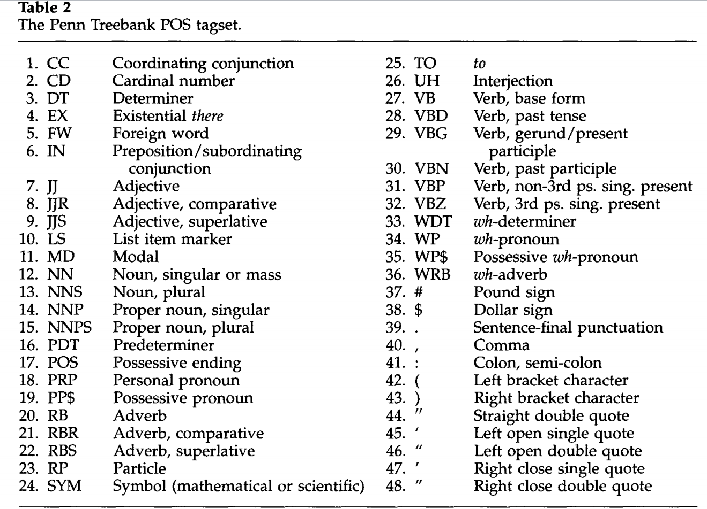
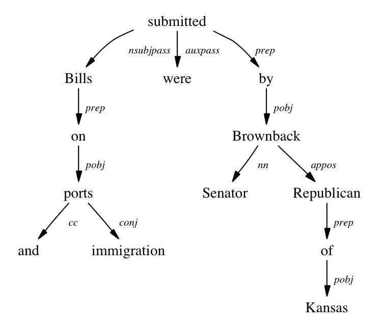

```{r setup, include=FALSE}
knitr::opts_chunk$set(echo = TRUE)
library(dplyr)
options(dplyr.print_max = 6, dplyr.print_min = 6)
options(width = 68)
```

# Setup

### Packages

To run the following code, make sure you have loaded (and installed)
the following packages. We like to set **ggplot2** to use the minimal
theme, but this is of course entirely optional.

```{r, message=FALSE}
library(cleanNLP)
library(dplyr)
library(readr)
library(stringi)
library(ggplot2)
theme_set(theme_minimal())
```

# Annotation engines

### Back ends

We have been able to get some real, interesting results by splitting
our raw text into tokens. Some clever filtering and use of external
datasets has gotten us some rough results in terms of character
identification and the detection of themes.

To go deeper though, we need a more advanced natural language
processing engine. These extract more granular features of the
text, such as identifying parts of speech and tagging particular
known entities.

### Back end, cont.

In **cleanNLP**, we currently provide back ends to two of the
most well-known such libraries:

- [**spaCy**](https://spacy.io/) a Python library primarily built for
speed and stability
- [**CoreNLP**](https://stanfordnlp.github.io/CoreNLP/) a Java library
built to have bleeding-edge functionality

### Initialising back ends

To use one of these backends in **cleanNLP**, simply run an
alternative `init_` function before annotating the text.
Either use:

```{r, eval = FALSE}
library(cleanNLP)
init_spaCy(model_name = "en")
anno <- run_annotators(paths)
nlp <- get_combine(anno)
```

Or:

```{r, eval = FALSE}
library(cleanNLP)
init_coreNLP(language = "en")
anno <- run_annotators(paths)
nlp <- get_combine(anno)
```

### Annotation results

The resulting data set `nlp` also has one row per token,
but now there are many additional features that have been
learned from the text:

```{r, echo = FALSE, message = FALSE}
nlp <- read_csv("data/sh_nlp.csv.gz")
```
```{r, echo = FALSE}
nlp
```

### Annotation tasks

NLP backends use models to learn features about the
words and sentences in our raw text. Common tasks include:

- tokenisation
- lemmatisation
- sentence boundaries
- part of speech tags
- dependencies
- named entities
- coreferences
- sentiment analysis
- word embeddings

A collection of these running together (as they typically
need to), is known as an **NLP Pipeline**. We will explain
the meaning behind and some applications of many of these 
annotation tasks in these slides.

### Back end details

- options passed to the `init_` functions control which models and
annotations are selected
- models have to be trained specifically for every natural
language that they support
- more complex annotation tasks need to be trained seperately for
different styles of speech (i.e., Twitter versus Newspapers)
- libraries needed for these types of annotations require large
external dependencies in order to run correctly
- in the interest of time, today we will simply provide the
annotation objects for our corpora of study.

More detailed instructions for setting up either back end can
be found on the
[cleanNLP repository](https://github.com/statsmaths/cleanNLP)
and we are happy to help as best we can during the break or after
the tutorial.

### Reading data

As mentioned above, we have already run the spaCy annotators on
the corpus of Sherlock Holmes stories and made them available in
the GitHub repository:

```{r, message = FALSE}
paths <- dir("data/holmes_stories", full.names = TRUE)
sh_meta <- data_frame(id = seq_along(paths),
                   story = stri_sub(basename(paths), 4, -5))
sh_nlp <- read_csv("data/sh_nlp.csv.gz")
```

# Sentence Boundaries

### More accurate average sentence length

By using the sentence boundaries learned by the NLP pipeline,
we can more accurately count the average length of the
sentences in each text. 

```{r, eval = FALSE}
sh_nlp %>%
  group_by(id, sid) %>%
  mutate(sentence_end = tid == max(tid)) %>%
  group_by(id) %>%
  summarize(mean_sentence_len = n() / sum(sentence_end)) %>%
  ggplot(aes(id, mean_sentence_len)) +
    geom_line() +
    geom_point()
```

Errors that might occur in our original method primarily
include abbrevations such as "Dr." and "S.O.S.".

### More accurate average sentence length

```{r, echo = FALSE}
sh_nlp %>%
  group_by(id, sid) %>%
  mutate(sentence_end = tid == max(tid)) %>%
  group_by(id) %>%
  summarize(mean_sentence_len = n() / sum(sentence_end)) %>%
  ggplot(aes(id, mean_sentence_len)) +
    geom_line() +
    geom_point()
```

# Lemmatisation 

### Lemmas

The most simple new column is the one titled `lemma`. This contains
a reduced form of the token, for example converting all verbs
into the same tense and all nouns into the singular case.

### Lemmas, examples

```{r}
sh_nlp %>% filter(tolower(word) != lemma) %>%
  select(word, lemma) %>% print(n = 10)
```

### Using lemmas

While minor, this assists with the topic discovery we did in
the previous session by using the lemma frequency rather than
the word frequency.

```{r}
sh_lemmafr <- sh_nlp %>%
  left_join(word_frequency, by = c("lemma" = "word")) %>%
  filter(!is.na(frequency)) %>%
  filter(frequency < 0.01) %>%
  filter((tolower(word) == word)) %>%
  count(id, lemma) %>%
  top_n(n = 10, n) %>%
  left_join(sh_meta, by = "id") %>%
  arrange(id, desc(n))
```
```{r, echo = FALSE}
sh_lemmafr <- ungroup(sh_lemmafr)
```

### Using lemmas

```{r}
sh_lemmafr %>% filter(id == 1) %>% print(n = 12)
```

# Part of Speech Tags

### Using POS tags

Many of the tricks we used in the last session revolved around finding
ways to approximate part of speech tags:

- stop words list, for example, removes (amongst other things)
punctuation marks, pronouns, conjunctions, and interjections
- checking for upper case marks is really a hunt to identify proper nouns
- the frequency table is largely trying to remove verbs (there are far
fewer of these and they tend to be more common), as well as common nouns

Proper part of speech tags can let us do these things more accurately as
well as make other types of analysis possible.

### POS granularity

In primary or secondary school, you probably learned about a dozen or
so parts of speech. These include nouns, verbs, adjectives, and so
forth. Linguists in fact identify a far more granular set of part
of speech tags, and even amongst themselves do not agree on a fixed
set of such tags.

A commonly used one, and the one implemented by
spaCy, are the
[Penn Treebank codes](http://www.clips.ua.ac.be/pages/mbsp-tags).
These are given in our dataset under the `pos` variable.

### Penn Treebank



### Universal part of speech

Work has also been done to map these granular codes to
language-agnostic codes known as universal parts of speech.
Coincidentally, these universal parts of speech mimic those commonly
taught in schools:

- *VERB*: verbs (all tenses and modes)
- *NOUN*: nouns (common and proper)
- *PRON*: pronouns 
- *ADJ*: adjectives
- *ADV*: adverbs
- *ADP*: adpositions (prepositions and postpositions)
- *CONJ*: conjunctions
- *DET*: determiners
- *NUM*: cardinal numbers
- *PRT*: particles or other function words
- *X*: other: foreign words, typos, abbreviations
- *.*: punctuation

These are contained in the variable `upos`,
and for today will be the most useful for our analysis.

### Top characters, again

Here, for example, is the analysis of key characters with our trick
replaced by filtering on the proper noun tag "PROPN":

```{r}
sh_topchar <- sh_nlp %>%
  filter(upos == "PROPN") %>%
  count(id, word) %>%
  top_n(n = 10, n) %>%
  left_join(sh_meta, by = "id") %>%
  arrange(id, desc(n))
```
```{r, echo = FALSE}
sh_topchar <- ungroup(sh_topchar)
```

### Top characters, again

```{r}
sh_topchar %>% filter(id == 1) %>% print(n = Inf)
```

### Compound words (optional)

A major shortcoming in our tabulation of proper nouns is that many
of the proper nouns, in fact most in this case, are actually compound
words. The proper way to analyse this data would be to collapse the
compound words into a single combined token. It is relatively easy to
do this in a slow way with loops. A fast, vectorized method with **dplyr**
verbs is show in the code chunk below:

```{r}
sh_compound <- sh_nlp %>%
  filter(upos == "PROPN") %>%
  group_by(id, sid) %>%
  mutate(d = tid - lag(tid) - 1) %>%
  mutate(d = ifelse(is.na(d), 1, d)) %>%
  ungroup() %>%
  mutate(d = cumsum(d)) %>%
  group_by(d) %>%
  summarize(id = first(id), sid = first(sid),
            tid = first(tid),
            thing = stri_c(word, collapse = " ")) %>%
  select(-d) %>%
  inner_join(sh_nlp, by = c("id", "sid", "tid"))
```

### Compound words (optional)

```{r}
sh_compound %>% select(id, thing) %>% print(n = 10)
```

# Named Entity Recognition

### Entities

The task of finding characters, places, and other references to
proper objects is common enough that it has been wrapped up into
a specific annotation task known as named entity recognition (NER).
Here are the first few entities from the annotation of our
stories

```{r}
results <- sh_nlp %>%
  select(id, entity, entity_type) %>%
  filter(!is.na(entity))
```

### Entities, cont.

```{r}
results %>% print(n = 10)
```

### NER characters

One benefit of this is that NER distinguishes between people and
places, making our tabulation even more accurate:

```{r}
sh_nerchar <- sh_nlp %>%
  select(id, entity, entity_type) %>%
  filter(!is.na(entity)) %>%
  filter(entity_type == "PERSON") %>%
  count(id, entity) %>%
  top_n(n = 10, n) %>%
  left_join(sh_meta, by = "id") %>%
  arrange(id, desc(n))
```
```{r}
sh_nerchar <- ungroup(sh_nerchar)
```

### NER characters, cont.

```{r}
sh_nerchar %>% filter(id == 1) %>% print(n = Inf)
```

### Other entity categories

There are many other categories of named entities
available within the spaCy and CoreNLP libraries,
including:

- *ORGA*: Companies, agencies, institutions, etc.
- *MONEY*: Monetary values, including unit.
- *PERCENT*: Percentages.
- *DATE*: Absolute or relative dates or periods.
- *TIME*: Times smaller than a day.
- *NORP*: Nationalities or religious or political groups.
- *FACILITY*: Buildings, airports, highways, bridges, etc.
- *GPE*: Countries, cities, states.
- *LOC*: Non-GPE locations, mountain ranges, bodies of water.
- *PRODUCT*: Objects, vehicles, foods, etc. (Not services.)
- *EVENT*: Named hurricanes, battles, wars, sports events, etc.
- *WORK_OF_ART*: Titles of books, songs, etc.
- *LANGUAGE*: Any named language.
- *QUANTITY*: Measurements, as of weight or distance.
- *ORDINAL*: "first", "second", etc.
- *CARDINAL*: Numerals that do not fall under another type.

How might these be useful in various textual analyses?

# Dependency Parsing

### Dependencies

Dependencies are links between tokens within
a sentence that indicate grammatical relationships.

For example, they link adjectives to the nouns they describe
and adverbs to the verbs they modify. One of the most common
dependencies is the direct object tag "dobj", linking a verb
to the noun that receives the action of the verb.

### Fully parsed sentence



### Dependencies, example

```{r}
sh_nlp %>% filter(id == 1, sid == 1) %>%
  select(word, source, relation, word_source)
```


### What are characters doing?

One way that dependencies can be useful is by determining
which verbs are associated with each character by way of
the 'nsubj' relation. Amongst other things, this can help
identify sentiment, biases, and power dynamics.

In our corpus, we can use the 'nsubj' tag to identify 
verbs associated with our main characters:

```{r}
sh_whatchar <- sh_nlp %>%
  filter(relation == "nsubj") %>%
  filter(upos == "PROPN") %>%
  count(id, word, lemma_source) %>%
  filter(n > 1)
```
```{r, echo = FALSE}
sh_whatchar <- ungroup(sh_whatchar)
```

### What are characters doing?

```{r}
sh_whatchar %>% print(n = 12)
```
