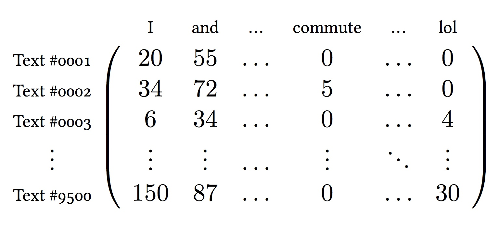
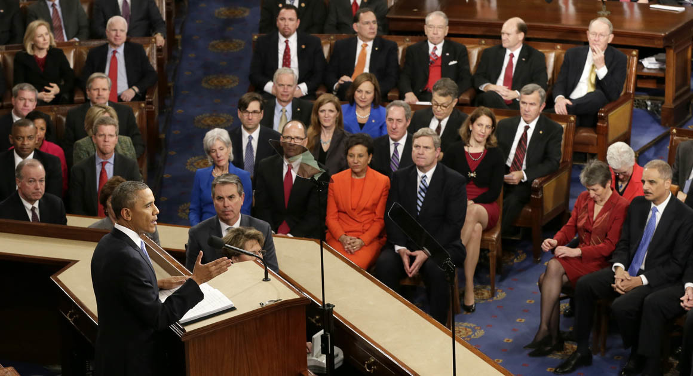
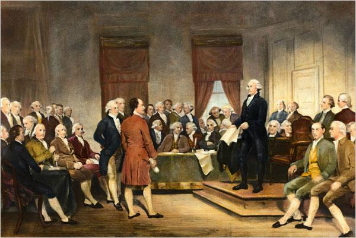

```{r setup, include=FALSE}
knitr::opts_chunk$set(echo = TRUE)
library(dplyr)
options(dplyr.print_max = 6, dplyr.print_min = 6)
options(width = 68)
```

# Setup

### Packages

To run the following code, we again make sure that the following
packages are loaded (and installed) the following packages.

```{r, message=FALSE}
library(cleanNLP)
library(dplyr)
library(readr)
library(stringi)
library(ggplot2)
library(topicmodels)
library(glmnet)
library(ggrepel)
library(viridis)
library(magrittr)
theme_set(theme_minimal())
```

You will also need to download and set-up the tutorial's
datasets.

### The Data

The President of the United States is constitutionally obligated to provide
a report known as the 'State of the Union'. The report summarizes the
current challenges facing the country and the president's upcoming legislative agenda.

We have run the spaCy NLP pipeline over this corpus and provide the
output data in the GitHub repository.
```{r, message = FALSE}
sotu_nlp <- read_csv("data/sotu.csv.gz")
sotu_meta <- read_csv("data/sotu_meta.csv")
```

# Exploratory Analysis

### Sentence lengths

Just because we are doing text analysis is no excuse for not doing basic
exploratory analysis of our data. What, for example, is the distribution
of sentence lengths in the corpus?

```{r}
sotu_nlp %>%
  count(id, sid) %$%
  quantile(n, seq(0,1,0.1))
```

### Common nouns

What are the most common nouns in the corpus?

```{r}
sotu_nlp %>%
  filter(upos == "NOUN") %>%
  count(lemma) %>%
  top_n(n = 40, n) %>%
  use_series(lemma)
```

### Length in words

Now, how long is each State of the Union in words? Does this differ based
on whether it was given as a speech or a written document?

```{r, eval = FALSE}
sotu_nlp %>%
  count(id) %>%
  group_by(id) %>%
  left_join(sotu_meta, by = "id") %>%
  ggplot(aes(year, n)) +
    geom_line(color = grey(0.8)) +
    geom_point(aes(color = sotu_type)) +
    geom_smooth()
```


### Length in words

```{r, echo = FALSE, message = FALSE}
sotu_nlp %>%
  count(id) %>%
  group_by(id) %>%
  left_join(sotu_meta, by = "id") %>%
  ggplot(aes(year, n)) +
    geom_line(color = grey(0.8)) +
    geom_point(aes(color = sotu_type)) +
    geom_smooth() +
    scale_color_viridis(discrete=TRUE, end = 0.7, option = "C") +
    theme(axis.text.x = element_text(size = 12),
          legend.position="bottom",
          axis.text.y = element_text(size = 12),
          axis.title.x = element_text(size = 14),
          axis.title.y = element_text(size = 14)) +
    xlab("Year") +
    ylab("Number of words") +
    labs(color = "SOTU Address type")
```

# Document Summarisation

### Summarising with dependencies

A straightforward way of extracting a high-level summary of the
content of a speech is to extract all direct object object
dependencies where the target noun is not a very common word.

Here is an example of this using the first address made
by George W. Bush in 2001:

```{r}
summary_2001 <- sotu_nlp %>%
  left_join(sotu_meta, by = "id") %>%
  filter(year == 2001, relation == "dobj") %>%
  left_join(word_frequency, by = "word") %>%
  filter(frequency < 0.001) %>%
  select(id, word, word_source) %$%
  sprintf("%s => %s", word_source, word)
```

### George W. Bush (2001)

```{r}
summary_2001
```

### George W. Bush (2002)

```{r, echo = FALSE}
summary_2002 <- sotu_nlp %>%
  left_join(sotu_meta, by = "id") %>%
  filter(year == 2002, relation == "dobj") %>%
  left_join(word_frequency, by = "word") %>%
  filter(frequency < 0.001) %>%
  select(id, word, word_source) %$%
  sprintf("%s => %s", word_source, word)
```
```{r}
head(summary_2002, 34)
```


### Woodrow Wilson (1919)

```{r, echo = FALSE}
summary_1919 <- sotu_nlp %>%
  left_join(sotu_meta, by = "id") %>%
  filter(year == 1919, relation == "dobj") %>%
  left_join(word_frequency, by = "word") %>%
  filter(frequency < 0.001) %>%
  select(id, word, word_source) %$%
  sprintf("%s => %s", word_source, word)
```
```{r}
head(summary_1919,  34)
```

# Term Frequency Matrices

### NLP and matrices

So far, we have done all of our analysis using a data frame where each
token is given its own row. For modelling purposes, we often want to
calculate the term frequency matrix. This matrix has one row per document
and one column per unique token in the data set (although we can limit
which tokens actually have a column).

Conveniently, **cleanNLP** provides the function `get_tfidf` for
calculated this matrix.

### Document term frequency matrix



### get_tfidf()

Here we will construct a term frequency matrix from only non-proper
nouns:

```{r}
sotu_tfidf <- sotu_nlp %>%
  filter(pos %in% c("NN", "NNS")) %>%
  get_tfidf(min_df = 0.05, max_df = 0.95,
                      type = "tfidf", tf_weight = "dnorm")
```

### get_tfidf()

The output is a list with three elements: the term frequency inverse
document frequency matrix, the ids of the documents corresponding to
row names, and the vocabulary corresponding to the column names.

```{r}
head(sotu_tfidf$vocab, 20)
head(sotu_tfidf$id, 20)
dim(sotu_tfidf$tfidf)
```

### PCA

What specifically can we do with this data? As a starting point, we
will compute the principal components of the matrix. While base-R
has great functions for doing this, we'll make use of the **cleanNLP**
function `tidy_pca` which returns a data frame that makes plotting
in **ggplot2** easier:

```{r}
sotu_pca <- tidy_pca(sotu_tfidf$tfidf, sotu_meta)
select(sotu_pca, president, party, PC1, PC2)
```

### PCA plot

While a simple scatter plot of this is easy to construct, we can
tweak some of the default settings to get a really nice visualization
of where each President's speeches cluster:

```{r, eval = FALSE}
ggplot(sotu_pca, aes(PC1, PC2)) +
  geom_point(aes(color = cut(year, 10, dig.lab = 4))) +
  geom_text(data = filter(sotu_pca, !duplicated(president)))
```

### PCA plot, cont.

```{r, echo = FALSE, message = FALSE}
ggplot(sotu_pca, aes(PC1, PC2)) +
  geom_point(aes(color = cut(year, 10, dig.lab = 4)), alpha = 0.35,
                 size = 4) +
  geom_text_repel(data = filter(sotu_pca, !duplicated(president)),
                  aes(label = president),
                  color = grey(0.4), cex = 3) +
  labs(color = "Year") +
  scale_color_viridis(discrete=TRUE, end = 0.9, option = "C") +
  theme(axis.title.x = element_text(size = 14),
        axis.title.y = element_text(size = 14),
        axis.text.x = element_blank(),
        axis.text.y = element_blank())
```

# Topic Models

### Topic Models

Topic models are a collection of statistical models for describing
abstract themes within a textual corpus. Each theme is
characterized by a collection of words that commonly co-occur; for example,
the words 'crop', 'dairy', 'tractor', and 'hectare', might define a *farming*
theme.

One of the most popular topic models is latent Dirichlet
allocation (LDA), a Bayesian model where each topic is described by
a probability distribution over a vocabulary of words. Each document
is then characterized by a probability distribution over the available topics.

### LDA

To fit LDA on a corpus of text parsed by
the **cleanNLP** package, the output of `get_tfidf` can be piped
directly to the `LDA` function in the package **topicmodels**.
The topic model function requires raw counts, so the type variable in
`get_tfidf` is set to "tf".

```{r, eval = FALSE}
sotu_tf <- sotu_nlp %>%
  filter(pos %in% c("NN", "NNS")) %>%
  get_tfidf(min_df = 0.05, max_df = 0.95,
                      type = "tf", tf_weight = "raw")
tm <- LDA(sotu_tf$tf, k = 16, control = list(verbose = 1))
```
```{r, echo = FALSE}
# this takes a few minutes to run and we don't want
# to wait everytime for it to finish, so load from
# cache... also, the results are stochastic (and seem
# to not respect set.seed); this fixes the problem
# as well
sotu_tf <- sotu_nlp %>%
  filter(pos %in% c("NN", "NNS")) %>%
  get_tfidf(min_df = 0.05, max_df = 0.95,
                      type = "tf", tf_weight = "raw")
tm <- read_rds("data/sotu_tm.Rds")
```

### Describing topics

We can describe each topic by giving the five most important words
in each topic:

```{r}
terms <- posterior(tm)$terms
topics <- posterior(tm)$topics
topic_df <- data_frame(topic = as.integer(col(topics)),
                       id = sotu_meta$id[as.integer(row(topics))],
                       val = as.numeric(topics)) %>%
              left_join(sotu_meta, by = "id")
top_terms <- apply(terms, 1,
               function(v) paste(sotu_tf$vocab[order(v,
                  decreasing = TRUE)[1:5]], collapse = ", "))
top_terms <- as.character(top_terms)
```

### Describing topics

```{r}
top_terms
```

### Topics over time

```{r, echo = FALSE}
index <- rank(-1 * tapply(topic_df$year * topic_df$val,
                          topic_df$topic, which.max))
topic_df$topic_new <- index[topic_df$topic]
top_terms_df <- data_frame(top_terms, topic = 1:length(top_terms))
top_terms_df$topic_new <- index[top_terms_df$topic]
```

```{r, echo = FALSE}
ggplot(topic_df, aes(year, topic_new)) +
  geom_point(aes(size = val, color = factor(topic_new))) +
  geom_text(data = top_terms_df, x = mean(topic_df$year),
            size = 5.5, aes(y = topic_new + 0.4, label = top_terms,
            color = factor(topic_new)),
            show.legend = FALSE) +
    scale_color_viridis(discrete=TRUE, end = 0.7, option = "C") +
  theme(axis.text.y=element_blank(),
        axis.title.y=element_blank(),
        legend.position="bottom",
        axis.title.x = element_text(size = 16),
        axis.text.x = element_text(size = 14)) +
  labs(size = "Posterior probability") +
  xlab("Year") +
  guides(colour = FALSE)
```

# Authorship Detection

### Predictive models

A classifier that distinguishes speeches made by two presidents
will be constructed here for the purpose of illustrating the
topical and stylistic differences between them and their
speech writers.

As a first step, a term-frequency matrix is extracted using
the same technique as was used with the topic modeling function.
However, here the frequency is computed for each sentence in the
corpus rather than the document as a whole.

### 'George Bush (2001-2008)'


### 'Barack Obama (2009-2016)'



### Design matrix

The ability to do this seamlessly with a single additional `mutate`
function defining a new id illustrates the flexibility of the
`get_tfidf` function.

```{r}
df <- sotu_nlp %>%
  left_join(sotu_meta, by = "id") %>%
  filter(president %in% c("Barack Obama", "George W. Bush")) %>%
  mutate(new_id = paste(id, sid, sep = "-")) %>%
  filter(pos %in% c("NN", "NNS"))
mat <- get_tfidf(df, min_df = 0, max_df = 1, type = "tf",
                 tf_weight = "raw", doc_var = "new_id")
```

### Training and testing sets

It will be necessary to define a response variable `y` indicating
whether this is a speech made by President Obama as well as a
training flag indicating which speeches were made in odd numbered
years.

```{r, message = FALSE}
m2 <- data_frame(new_id = mat$id) %>%
  left_join(df[!duplicated(df$new_id),]) %>%
  mutate(y = as.numeric(president == "Barack Obama")) %>%
  mutate(train = (year %% 2 == 0))
```

### Elastic net

The output may now be used as input to the elastic net function provided
by the **glmnet** package. This function fits a model of the form:

$$ \beta = \text{argmin}_b \left\{ || y - X b ||_2 + \lambda \cdot (\alpha) || b ||_1 + \lambda \cdot (1 - \alpha) || b ||_2^2 \right\} $$

Cross-validation is used in order to select the best value of the model's tuning parameter $\lambda$.

```{r, message = FALSE}
model <- cv.glmnet(mat$tf[m2$train,], m2$y[m2$train],
                   family = "binomial", alpha = 0.9)
```

The response is set to the binomial family given the binary nature
of the response and training is trained on only those speeches
occurring in odd-numbered years.


### Predicted probabilities

We can add the predicted probabilites to the dataset
`m2` with the following:

```{r}
m2$pred <- predict(model, newx = mat$tf, type = "response",
                   s = model$lambda.1se)
select(m2, new_id, id, sid, president, year, pred)
```

### Predicted probabilities

A boxplot of the predicted classes for each sentence
within a speach is a good way of evaluating the model:

```{r, eval = FALSE}
ggplot(m2, aes(factor(year), pred)) +
  geom_boxplot(aes(fill = president))
```


### Predicted probabilities

```{r, echo = FALSE}
m2$pred <- predict(model, newx = mat$tf, type = "response",
                   s = model$lambda.1se)
ggplot(m2, aes(factor(year),pred)) +
  geom_boxplot(aes(fill = relevel(factor(president), "George W. Bush"))) +
  labs(fill = "President") + xlab("year") + ylab("predicted probability") +
  scale_fill_viridis(discrete = TRUE, alpha = 0.6, end = 0.75, option = "C") +
  coord_flip() +
  theme(axis.title.x = element_text(size = 12),
        axis.text.x = element_text(size = 10),
        axis.title.y = element_text(size = 12),
        axis.text.y = element_text(size = 10)) +
  ylab("Predicted probability") +
  xlab("Year")
```

### Model coefficients

One benefit of the penalized linear regression model is that it is possible to interpret the
coefficients in a meaningful way. Here are the non-zero elements of the regression vector,
coded as whether the have a positive (more Obama) or negative (more Bush) sign:

```{r}
beta <- coef(model, s = model[["lambda"]][10])[-1]
sprintf("%s (%d)", mat$vocab, sign(beta))[beta != 0]
```

### 'Bill Clinton (1993-2000)'


### Predicted probabilities (Bush vs. Clinton)

```{r, echo = FALSE, message = FALSE}
df <- sotu_nlp %>%
  left_join(sotu_meta) %>%
  filter(president %in% c("William J. Clinton", "George W. Bush")) %>%
  mutate(new_id = paste(id, sid, sep = "-")) %>%
  filter(pos %in% c("NN", "NNS"))
mat <- get_tfidf(df, min_df = 0, max_df = 1, type = "tf",
                 tf_weight = "raw", doc_var = "new_id")
m2 <- data_frame(new_id = mat$id) %>%
  left_join(df[!duplicated(df$new_id),]) %>%
  mutate(y = as.numeric(president == "William J. Clinton")) %>%
  mutate(train = (year %% 2 == 0))
model <- cv.glmnet(mat$tf[m2$train,], m2$y[m2$train], family = "binomial")
m2$pred <- predict(model, newx = mat$tf, type = "response",
                   s = model$lambda.1se)
ggplot(m2, aes(factor(year),pred)) +
  geom_boxplot(aes(fill = relevel(factor(president), "George W. Bush"))) +
  labs(fill = "President") + xlab("year") + ylab("predicted probability") +
  scale_fill_viridis(discrete = TRUE, alpha = 0.6, end = 0.75, option = "C") +
  coord_flip() +
  theme(axis.title.x = element_text(size = 12),
        axis.text.x = element_text(size = 10),
        axis.title.y = element_text(size = 12),
        axis.text.y = element_text(size = 10)) +
  ylab("Predicted probability") +
  xlab("Year")
```

### Model coefficents (Bush vs. Clinton)

```{r, message = FALSE}
beta <- coef(model, s = model[["lambda"]][9])[-1]
sprintf("%s (%d)", mat$vocab, sign(beta))[beta != 0]
```

### 'George Washington (1789-1797)'



### Predicted probabilities (Washington vs. Clinton)

```{r, echo = FALSE, message = FALSE}
df <- sotu_nlp %>%
  left_join(sotu_meta) %>%
  filter(president %in% c("William J. Clinton", "George Washington")) %>%
  mutate(new_id = paste(id, sid, sep = "-")) %>%
  filter(pos %in% c("NN", "NNS"))
mat <- get_tfidf(df, min_df = 0, max_df = 1, type = "tf",
                 tf_weight = "raw", doc_var = "new_id")
m2 <- data_frame(new_id = mat$id) %>%
  left_join(df[!duplicated(df$new_id),]) %>%
  mutate(y = as.numeric(president == "William J. Clinton")) %>%
  mutate(train = (year %% 2 == 0))
model <- cv.glmnet(mat$tf[m2$train,], m2$y[m2$train], family = "binomial")
m2$pred <- predict(model, newx = mat$tf, type = "response",
                   s = model$lambda.1se)
ggplot(m2, aes(factor(year),pred)) +
  geom_boxplot(aes(fill = relevel(factor(president), "George Washington"))) +
  labs(fill = "President") + xlab("year") + ylab("predicted probability") +
  scale_fill_viridis(discrete = TRUE, alpha = 0.6, end = 0.75, option = "C") +
  coord_flip() +
  theme(axis.title.x = element_text(size = 12),
        axis.text.x = element_text(size = 10),
        axis.title.y = element_text(size = 12),
        axis.text.y = element_text(size = 10)) +
  ylab("Predicted probability") +
  xlab("Year")
```

### Model coefficients (Washington vs. Clinton)

```{r, echo = FALSE}
beta <- coef(model, s = model[["lambda"]][12])[-1]
sprintf("%s (%d)", mat$vocab, sign(beta))[beta != 0]
```

### On your own

\Large \myorange{Take all State of the Union Addressess from 1982 to
the present. Build a classifier that detects whether the speech is given
by a Democrat or Republican.}

\myorange{How well does this model perform? Are any years or presidents
particularly difficult to classify?}
